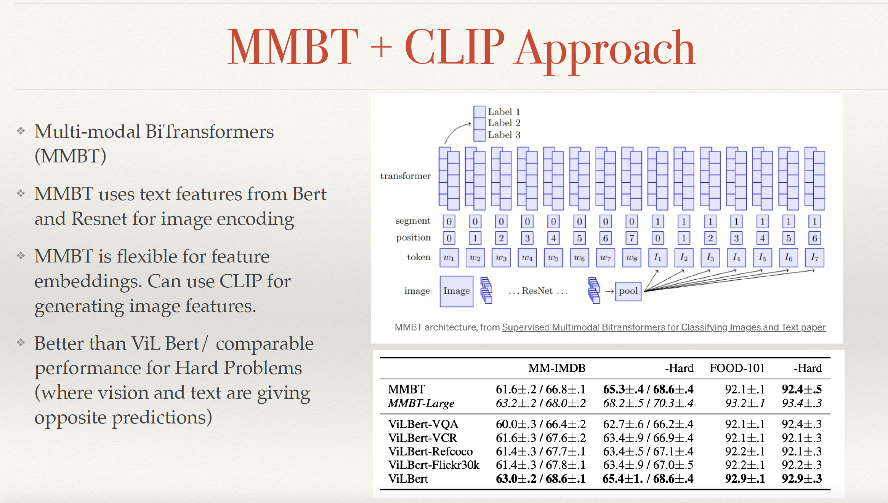
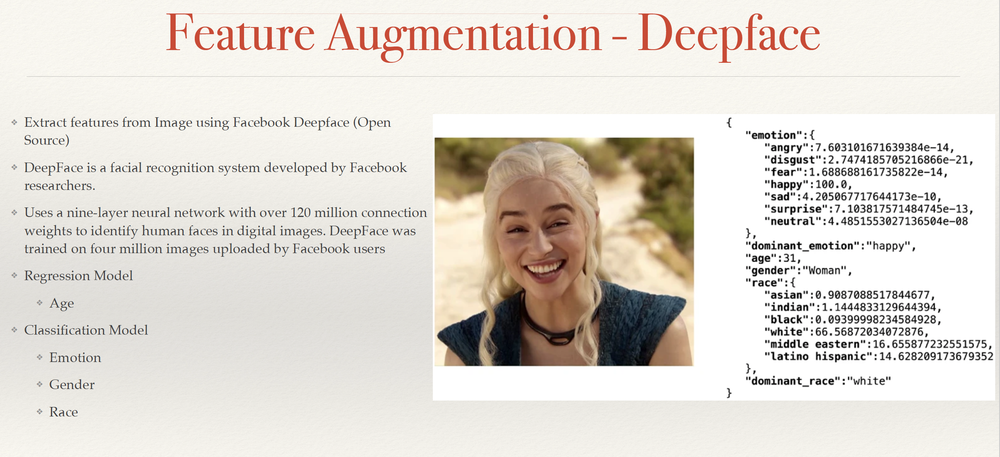
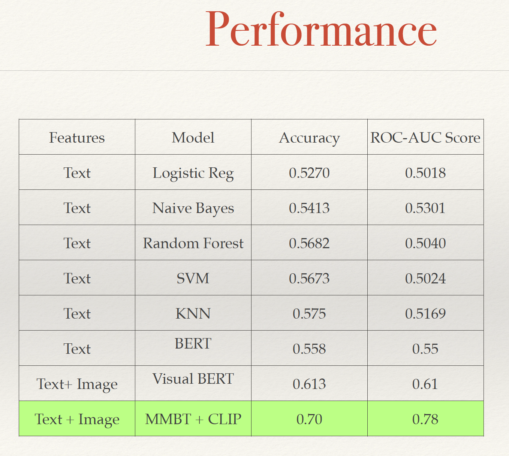

# Hateful Meme Identification Using Multi-Modal Approach

## Introduction
This project aims to identify hateful memes by combining different modalities, such as text and images, to understand and detect multimodal hate speech. Hateful memes present a unique challenge as they often combine seemingly innocuous images and text to convey hateful messages.

## Dataset
The dataset, created by FacebookAI, consists of 10,000 images in JSONL format, including 'train.jsonl' (8500 samples) and 'dev_seen.jsonl' (1040 samples). Each data point includes an ID, image path, text, and a label indicating whether the meme is hateful or not.

## Methods
### Unimodal Approaches
- Text feature extraction using TF-IDF.
- Classification models: Logistic Regression, Naive Bayes, Random Forest, SVM, KNN.

- BERT-based model using bert-base-uncased from Transformer Library.

### Multi-modal Approaches
- Visual BERT: A multi-modal vision and language model trained using COCO.

- MMBT + CLIP (OpenAI): Uses text features from BERT and ResNet for image encoding, flexible for feature embeddings.

### Feature Augmentation
- Facebook Deep Face algorithm: Extracts features from images for age, emotion, gender, and race classification.

- Google Web Detection Model: Detects web entities and provides context for images.

## Results
- Improvement in accuracy and AUC scores with multi-modal approaches compared to unimodal ones.

- The best performance achieved with the MMBT + CLIP approach.

## Future Work
- Exploring better feature processing methods.
- Dataset augmentation with manually labeled features.
- Ensembling methods like Vil-BERT, UNITER, Ernie-Vil on augmented features.

## References

- [Visual Bert](https://arxiv.org/abs/1908.03557)
- [CLIP](https://openai.com/research/clip) 
- [Facebook Meme Competition](https://ai.meta.com/blog/hateful-memes-challenge-and-data-set/)
- [Dataset Augmentation Approach](https://github.com/dsfsi/textaugment#eda-easy-data-augmentation-techniques-for-boosting-performance-on-text-classification-tasks)
- [CLIP + MMBT approach](https://towardsdatascience.com/how-to-get-high-score-using-mmbt-and-clip-in-hateful-memes-competition-90bfa65cb117)
- [Facebook Deep Face](https://research.facebook.com/publications/deepface-closing-the-gap-to-human-level-performance-in-face-verification/)
- [Google Web Detection Model](https://cloud.google.com/vision/docs/detecting-web)
